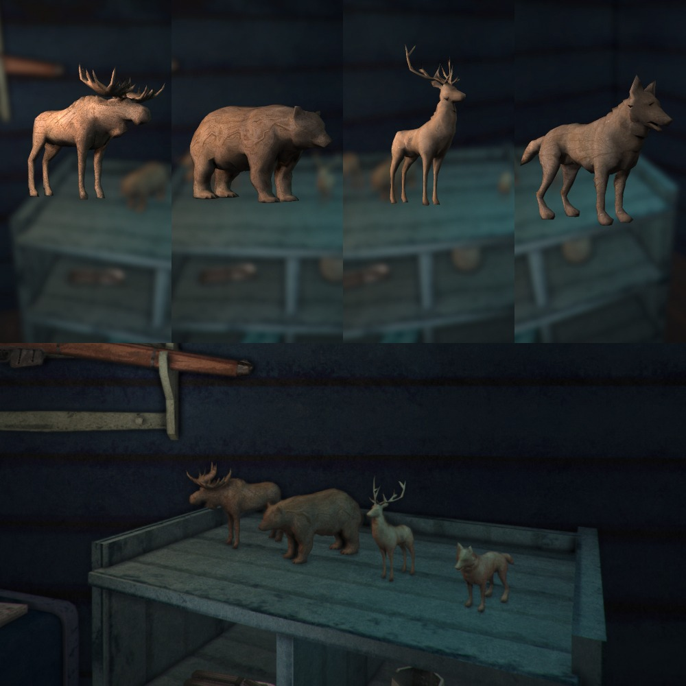

# Wooden Statuettes
This is a cozy mod for The Long Dark by Hinterland Studio, Inc.

## Special Thanks

[nbakulev](https://github.com/nbakulev) is the original creator of Wooden statuettes.

## [Patreon](https://www.patreon.com/ds5678)

I know many people might skip over this, but I hope you don't. You are so special, and I would appreciate your support. Modding takes lots of time, and I have expenses like food, internet, and rent. If you feel that I have improved your playing experience, please consider supporting me on my [Patreon](https://www.patreon.com/ds5678). Your support helps to ensure that I can continue making mods for you at the pace I am :)

## Localizations

You can help make Wooden Statuettes even better by contributing to its localized text entries!

Here is a list of the [Localizations](https://github.com/ds5678/ModComponent/wiki/Localizations) currently supported by The Long Dark.

Here is the [localization file](https://github.com/ds5678/WoodenStatuettes/blob/master/Unity/Assets/Localization.json) for Wooden Statuettes.

If you send me your translations, I'll update and add them to the mod so that more people can enjoy it in their native language.

## Installation

1. If you haven't done so already, install MelonLoader by downloading and running [MelonLoader.Installer.exe](https://github.com/HerpDerpinstine/MelonLoader/releases/latest/download/MelonLoader.Installer.exe)
2. If you haven't done so already, download the latest version of `ModComponent.dll` from its [releases page](https://github.com/ds5678/ModComponent/releases)
3. Download the latest version of `ModSettings.dll` from its [release page](https://github.com/zeobviouslyfakeacc/ModSettings/releases).
4. Move `ModComponent.dll` and `ModSettings.dll` into the Mods folder in your TLD install directory.
5. Run The Long Dark once. It should generate a subfolder in your mods folder.
6. Download `WoodenStatuettes.modcomponent` from the [releases page](https://github.com/ds5678/WoodenStatuettes/releases)
7. Move `WoodenStatuettes.modcomponent` into the `ModComponentZips` folder within your mods folder.
